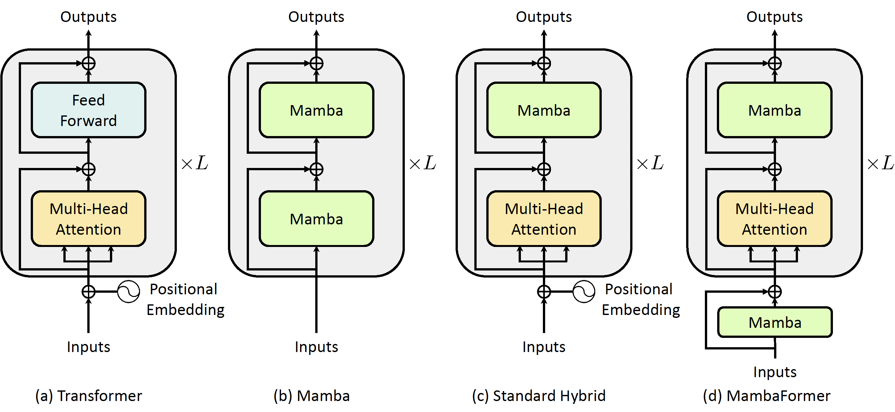

# MambaFormer In-context Learning
MambaFormer in-context learning experiments and implementation from https://arxiv.org/abs/2402.04248



## Getting started
You can start by cloning our repository and following the steps below.

1. Install the dependencies for our code using Conda.

    ```
    conda env create -f environment.yml
    conda activate mambaformer
    pip install -r requirements.txt
    ```

2. Then install mamba-ssm from our repo and the necessary requirements such as causal-conv1d. We use [mamba-ssm](https://github.com/state-spaces/mamba.git) v1.1.1 modified.
    ```
    pip install causal-conv1d==1.1.3.post1
    cd mamba/
    pip install -e .
    cd ../src
    ```

## Experiments
To train your own model, run the following command in the `src/` directory.

```
# For standard 1GPU training
python train.py --config conf/linear_regression.yaml

# For data parallel training (only needed for many-outlier regression)
CUDA_VISIBLE_DEVICES=0,1 python train_parallel.py --config conf/many_outlier_regression.yaml
```

In our code, we consider each Attention or Mamba block as 1 layer. So Mamba or MambaFormer with `n_layer: 24` is roughly equivalent to gpt2 with `n_layer: 12` in total parameters. We include sample `linear_regression.yaml` files for each architecture in `src/conf`.


## LICENSE
The code is released under the Apache-2.0 License. See `LICENSE` for full terms.
The generated data is subject to the model owner's policy.


## Citation
[Can Mamba Learn How to Learn? A Comparative Study on In-Context Learning Tasks](https://arxiv.org/abs/2402.04248)  
```bibtex
@article{park2024mambaformer,
    title={Can Mamba Learn How to Learn? A Comparative Study on In-Context Learning Tasks},
    author={Park, Jongho and Park, Jaeseung and Xiong, Zheyang and Lee, Nayoung and Cho, Jaewoong and Oymak, Samet and Lee, Kangwook and Papailiopoulos, Dimitris},
    journal={International Conference on Machine Learning},
    year={2024}
}
```
